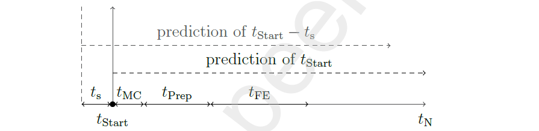

# Flexibility Quantification

This project is a plugin for the [AgentLib](https://github.com/RWTH-EBC/AgentLib). This agent-based framework employs model predictive control (MPC) to quantify flexibility offers of electricity usage of building energy systems (BES) during operation.

## Installation
To install, use the ``requirements.txt``. This project is compatible with Python 3.12 (3.11, 3.10 to be checked).

## Author
- Felix Stegemerten 

## Referencing the FlexQuant
A publication regarding the FlexQuant is currently in the work. A preprint is available under https://papers.ssrn.com/sol3/papers.cfm?abstract_id=5015569

## Tutorial
This section provides tutorials to help you get started with FlexQuant. It begins with an introduction to the framework's structure, followed by a detailed breakdown of an example to guide you through its application.

### The framework

<figure>
  
  <figcaption>Agent-based framework with the different agents and their mutual data exchange</figcaption>
</figure>

In total, the framework consists of six agents: Predictor Agent, BES Agent, three MPC Agents and a Flexibility Agent. The data exchange between these agents is illustrated in the image above. Let’s take a closer look at each agent and their interactions.

<ins>Predictor Agent</ins> \
The Predictor Agent provides a prediction trajectory of the boundary
conditions for the given use case to the MPC Agents. This includes factors such as weather conditions, electricity tariffs, comfort boundaries, and occupancy schedules. The data can either be historical or retrieved via API services to support real-time operation.

<ins>BES Agent</ins> \
The BES Agent simulates the energy system to be controlled. It can either use the same model as the MPC or a higher-fidelity model. In the latter case, the BES model does not need to be Python-based; for example, a Modelica model or even a real-world BES can be utilized. The BES Agent receives control signals from the MPC, applies them to the system, and subsequently sends the resulting measurements back to the MPC. 

<ins>MPC Agents</ins> \
The key components of the FlexQuant framework are the three MPCs: the **baseline MPC**, which controls the BES and two **shadow MPCs** for the estimation of the available flexibility.  

The **Baseline MPC** optimizes the system controls with the goal of minimizing the operation cost of the BES over the prediction horizon. It should be pointed out that only the controls given by the Baseline MPC is applied to the BES. 

The **Shadow MPCs** are used to calculate the maximal possible flexibility of the electricity usage during a defined flexibility event duration by the user. The reason why they are called shadow MPCs is that they are not used to control the BES actually, but only to help quantify the flexibility. There are two Shadow MPCs with a negative limit and positive limit respectively. The negative one calculate the control trajectory in such a way that the power used by the BES is maximized, so that the market has a negative power increase. The positive one does the opposite. The horizon of the Shadow MPCs is divided as following:

<figure>
  
  <figcaption>Split of the prediction horizon of the Shadow MPCs</figcaption>
</figure>

The time tMC

### Example
This section demonstrates how to use the FlexQuant package with the example **OneRoom_SimpleMPC**.  