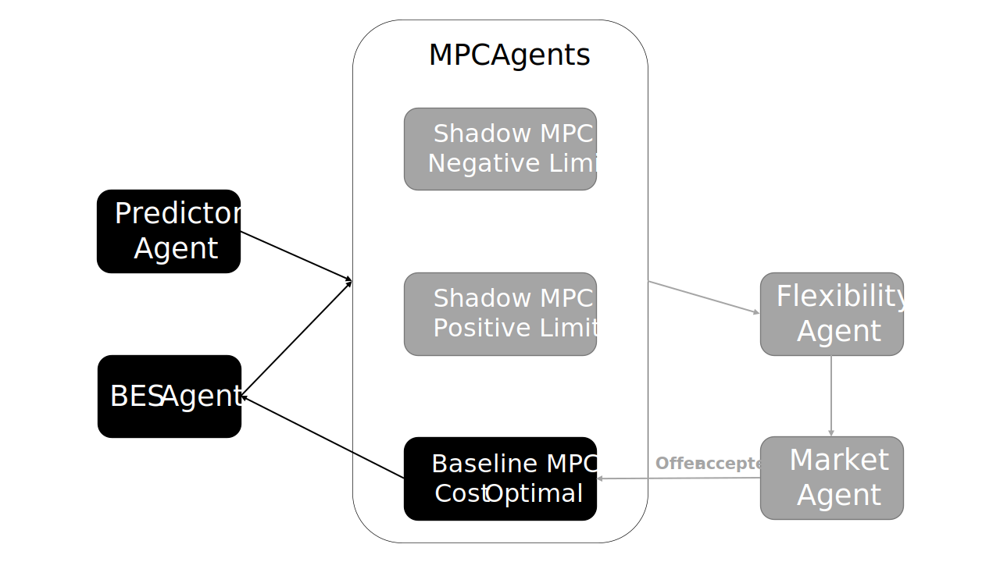

# Flexibility Quantification

This project is a plugin for the [AgentLib](https://github.com/RWTH-EBC/AgentLib). This agent-based framework employs model predictive control (MPC) to quantify flexibility offers of electricity usage of building energy systems (BES) during operation.

## Installation
To install, you can either use the ``requirements.txt`` or go for package installation with ``pip install -e .``. 
The ``-e`` option installs the package in editable mode, which should be done when working on this package.
 This project is compatible with Python 3.12 (3.11, 3.10 to be checked).

## Author
- Felix Stegemerten 

## Referencing the FlexQuant
A publication regarding the FlexQuant is currently in the work. A preprint is available under https://papers.ssrn.com/sol3/papers.cfm?abstract_id=5015569

## Tutorial
This section provides tutorials to help you get started with FlexQuant. It begins with an introduction to the framework's structure, followed by a detailed breakdown of an example to guide you through its application.

### The framework

<figure>
  
  <figcaption>Framework and data flow of the seven agents in FlexQuant</figcaption>
</figure>

In total, the framework consists of seven agents: Predictor Agent, BES Agent, three MPC Agents and a Flexibility Agent. The data exchange between these agents is illustrated with the arrows in the image above. For the normal use case without flexibility quantification, only the agents in the black box are active. The ones in the grey box are generated while quantifying the flexibility, Let’s take a closer look at each agent and their interactions.

<ins>Predictor Agent</ins> \
The Predictor Agent provides a prediction trajectory of the boundary
conditions for the given use case to the MPC Agents. This includes factors such as weather conditions, electricity tariffs, comfort boundaries, and occupancy schedules. The data can either be historical or retrieved via API services to support real-time operation.

<ins>BES Agent</ins> \
The BES Agent simulates the energy system to be controlled. It can either use the same model as the MPC or a higher-fidelity model. In the latter case, the BES model does not need to be Python-based; for example, a Modelica model or even a real-world BES can be utilized. The BES Agent receives control signals from the MPC, applies them to the system, and subsequently sends the resulting measurements back to the MPC. 

<ins>MPC Agents</ins> \
The key components of the FlexQuant framework are the three MPCs: the **baseline MPC**, which controls the BES and two **shadow MPCs** for the calculation of the available flexibility.  

The **Baseline MPC** is responsible for optimizing the operation of the BES with the primary objective of minimizing operational costs over the prediction horizon. Notably, only the control actions determined by the Baseline MPC are actually applied to the BES.

The **Shadow MPCs** are designed to assess the maximum possible flexibility in electricity usage over a user-defined flexibility event duration. These controllers are termed "shadow" because they do not directly control the BES; instead, they support the evaluation of system flexibility. Two Shadow MPCs are employed: The Negative Shadow MPC calculates the control trajectory that maximizes BES power consumption, leading to a negative power contribution to the market (i.e., higher grid consumption).
 The Positive Shadow MPC does the opposite. The horizon of the Shadow MPCs is divided as following: 

<figure>
  
  <figcaption>Split of the prediction horizon of the Shadow MPCs</figcaption>
</figure>

The time tMC is the market clearing time, during which a flexibility offer is active and the market can decide whether to take it. tPrep is the preparation time, where the system can prepare itself for the upcoming flexibility event in advance. In tFE the flexibility event takes place. 

<ins>Flexibility Agent</ins> \
The Flexibility Agent utilizes the power consumption predictions of the
three MPCs to calculate indicators for quantifying available flexibility offers.

<ins>Market Agent</ins> \
Once the Market Agent decides to accept a flexibility offer, it sends the accepted flexibility event back to the baseline MPC, and it must deliver it.

### Example
This section demonstrates how to use the FlexQuant package. Examples can be found in the folder Examples. 