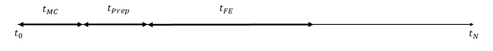

# Flexibility Quantification

This project is a plugin for the [AgentLib](https://github.com/RWTH-EBC/AgentLib). This agent-based framework employs model predictive control (MPC) to quantify flexibility offers of electricity usage of building energy systems (BES) during operation.

## Installation
To install, you can either use the ``requirements.txt`` or go for package installation with ``pip install -e .``.
The ``-e`` option installs the package in editable mode, which should be done when working on this package. Please use Python version 3.10, 3.11 or 3.12.

## Author
- Felix Stegemerten 
- Peter Kröning
- Hexuan Zhao
- Karthik Suresh

## Referencing the FlexQuant
A publication regarding the FlexQuant is currently in the work. A preprint is available under https://papers.ssrn.com/sol3/papers.cfm?abstract_id=5015569

## Tutorial
This section provides tutorials to help you get started with FlexQuant. It begins with the framework's structure, followed by the application. Functionality of each agent is introduced at the end. For more details, please refer to the literature mentioned above.

### The framework

<figure>
  
  <figcaption>Framework and data flow of the seven agents in FlexQuant</figcaption>
</figure>

In total, the framework consists of seven agents: Predictor Agent, BES Agent, three MPC Agents, an Indicator Agent and a market agent. The data exchange between these agents is illustrated with the arrows in the image above. The black boxes are a standard MPC setup created with [AgentLib](https://github.com/RWTH-EBC/AgentLib) and [Agentlib-MPC](https://github.com/RWTH-EBC/AgentLib-MPC/tree/main/agentlib_mpc). They serve as input for flexquant, the resulting output of which is represented with the grey boxes. For the normal use case without flexibility quantification, only the agents and communications in black are active. The ones in grey are generated while quantifying the flexibility. Detailed descriptions for each agent and their interactions can be found in this [section](#the-agents).

### Application
This section demonstrates how to use the FlexQuant package. Examples can be found in the folder [Examples](Examples). 

In general, a use case has the two following types of files:
- Flex_config: this is a json file that defines the configurations for the agents represented by the grey boxes in the [framework figure](#the-framework). It also specifies the modifications to the Baseline MPC when used in a FlexQuant framework compared to the standard control case. Note that not all the configurations are explicitly detailed within this file; instead, it may reference other configuration files, such as an indicator config in a separate JSON file.
- Modules: Each use case has its own specific BES, (Baseline) MPC and predictor module, represented as black boxes in the [framework figure](#the-framework). These Agents are implemented using the standard methods from  [AgentLib](https://github.com/RWTH-EBC/AgentLib) and [Agentlib-MPC](https://github.com/RWTH-EBC/AgentLib-MPC/tree/main/agentlib_mpc). For every module, there is a corresponding python file that defines its variables and functionality. Additionally, each module has a configuration JSON file, which can override the default variable values if specified.

To see how the package works in detail, read more [here](flexibility_quantification/README.md)

### The Agents

<ins>Predictor Agent</ins> \
The Predictor Agent provides a prediction trajectory of the boundary
conditions for the given use case to the MPC Agents. This includes factors such as weather conditions, electricity tariffs, comfort boundaries, and occupancy schedules. The data can either be historical or retrieved via API services to support real-time operation.

<ins>BES Agent</ins> \
The BES Agent simulates the energy system to be controlled. It can either use the same model as the MPC or a higher-fidelity one. In the latter case, the BES model does not need to be Python-based; for example, a Modelica model or even a real-world BES can be utilized. The BES Agent receives control signals from the MPC, applies them to the system, and subsequently sends the resulting measurements back to the MPC. 

<ins>MPC Agents</ins> \
The key components of the FlexQuant framework are the three MPCs: the **baseline MPC**, which controls the BES and two **shadow MPCs** for the calculation of the available flexibility.  

The **Baseline MPC** is responsible for optimizing the operation of the BES with the objective of minimizing operational costs over the prediction horizon. While used for flexibility quantification, it is slightly modified to include the extra function of delivering the accepted flex offer.

The **Shadow MPCs** are designed to assess the maximum possible flexibility of electricity usage over a user-defined flexibility event duration. They are termed "shadow" because they do not directly control the BES but only support the evaluation of system flexibility. Two Shadow MPCs are employed: The Negative Shadow MPC calculates the control trajectory that maximizes BES power consumption, leading to a negative power contribution to the market (i.e., higher grid consumption).
 The Positive Shadow MPC does the opposite. The prediction horizon of the Shadow MPCs is divided as following: 

<figure>
  
  <figcaption>Split of the prediction horizon of the Shadow MPCs</figcaption>
</figure>

The time tMC is the market clearing time, during which a flexibility offer in tFE is reserved and the market can decide whether to take it. The preparation time tPrep allows the system to prepare itself for the upcoming flexibility event in advance to maximize the flexibility in tFE, where the flexibility event takes place. 

Both the baseline and the shadow MPCs must have the storage variable ``E_stored`` for electrical energy as output, if the correction of the flexible energy cost is activated. According to definition in the package, ``E_stored`` increases as more electrical energy is stored in the system. Therefore, it should be defined as following:

- for heating case, E_stored = &sum; C * T / &eta; + other stored electrical energy
- for cooling case, E_stored = - &sum; C * T / &eta; + other stored electrical energy

where T is the temperature of the components in the system and &eta; could be e.g. the COP of a heat pump.

<ins>Indicator Agent</ins> \
The Indicator Agent utilizes the power consumption predictions of the
three MPCs to calculate key performance indicators for quantifying available flexibility offers. They could be the total energy, the peak power, the average power or the cost etc.

<ins>Market Agent</ins> \
Once the Market Agent decides to accept a flexibility offer, it sends the accepted flexibility trajectory back to the baseline MPC, which must deliver it in the corresponding time interval tFE.

